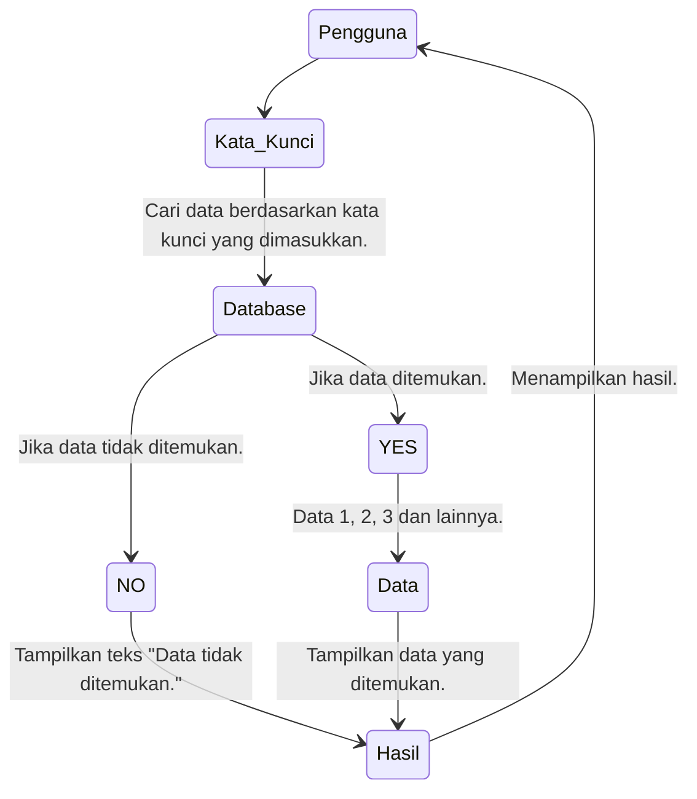
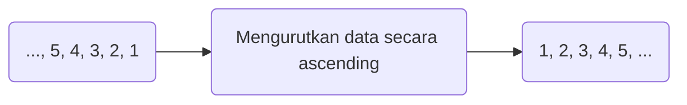
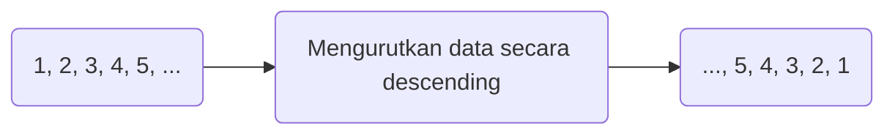
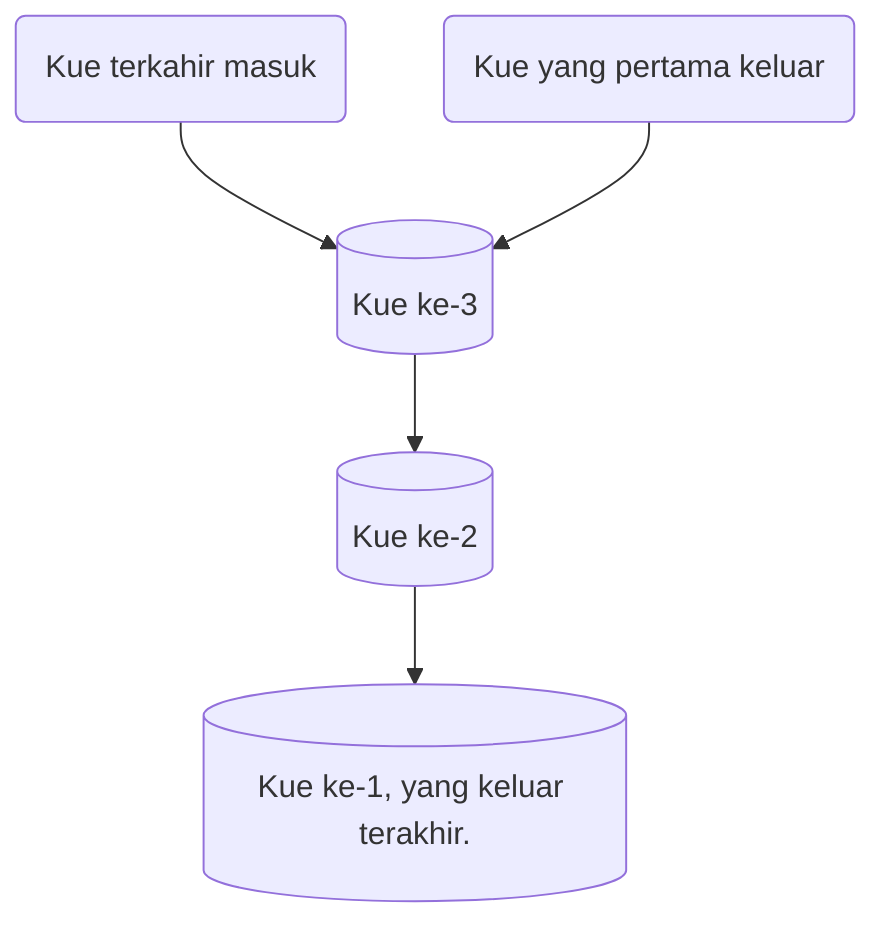
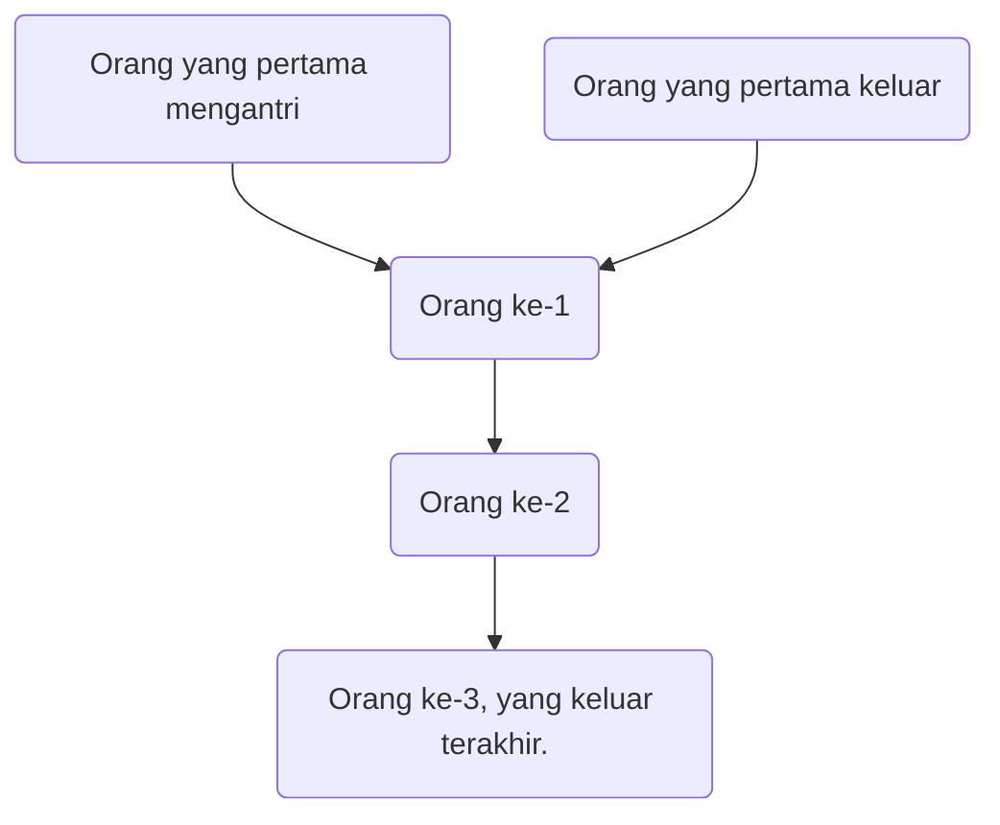

# Searching, Sorting, Stack dan Queue

Materi mengenai Searching, Sorting, Stack dan Queue.

## Pencarian (Searching)

Searching adalah sebuah metode pencarian guna menemukan data/informasi yang sedang dicari di dalam sebuah kumpulan data yang memiliki type data sama. Pencarian diperlukan untuk mendapatkan informasi/data dari kumpulan data yang belum diketahui.

## Pengurutan (Sorting)

Sorting adalah proses mengatur sekumpulan objek menurut aturan atau susunan tertentu. Urutan objek tersebut dapat menaik (ascending = dari data kecil ke data lebih besar) atau menurun (descending = dari data besar ke data lebih kecil).

Contoh diagram untuk pengurutan menaik (ascending):

Contoh diagram untuk pengurutan menurun (descending):

## Tumpukan (Stack)

Stack itu adalah struktur data yang menggunakan paradigma LIFO (Last In First Out), di mana elemen yang terakhir masuk adalah yang pertama keluar.  Misalkan, kita mempunyai setoples kue, jika kita ingin mengambil/mengeluarkan kue tersebut, otomatis kue yang pertama kita ambil adalah kue yang berada diposisi paling atas (yang terakhir dimasukkan)

Diagram stack:

## Antrian (Queue)

Queue merupakan struktur data yang menggunakan paradigma FIFO (First In First Out), dimana yang elemen pertama masuk adalah elemen yang pertama keluar. Contohnya saat kita mengantri untuk membeli sesuatu di toko atau minimarket, jika kita yang pertama mengantri, maka kita yang pertama keluar.

Diagram queue:

